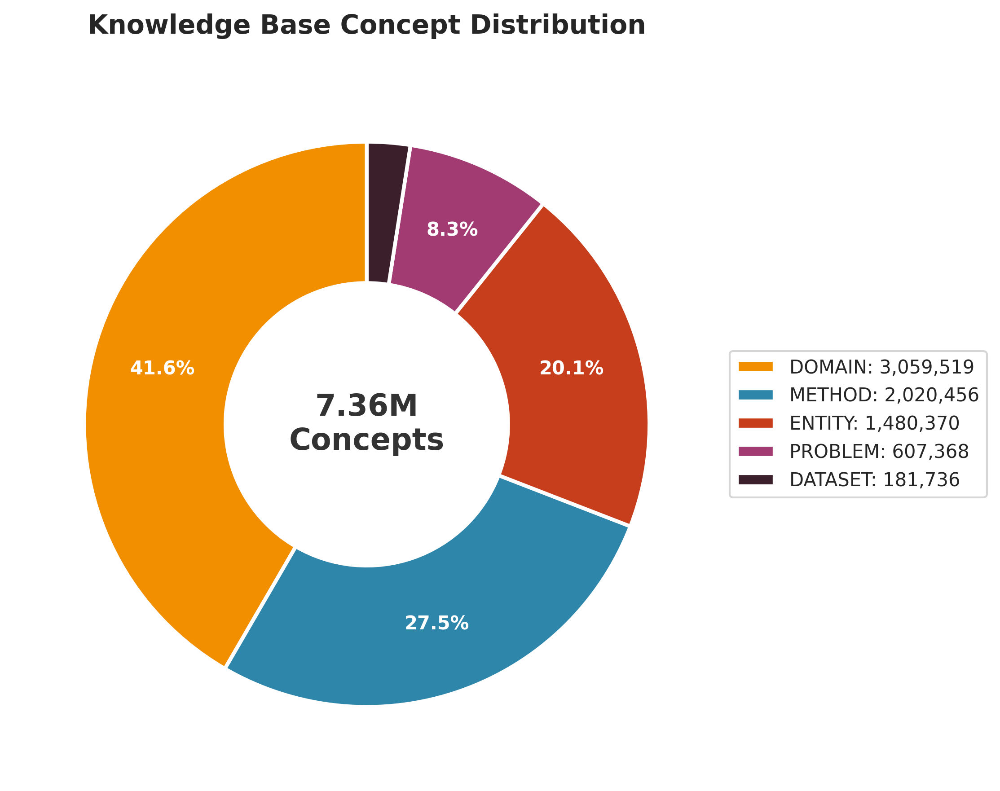
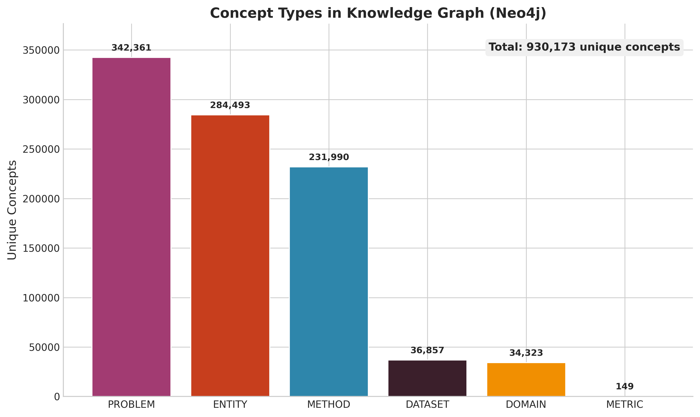
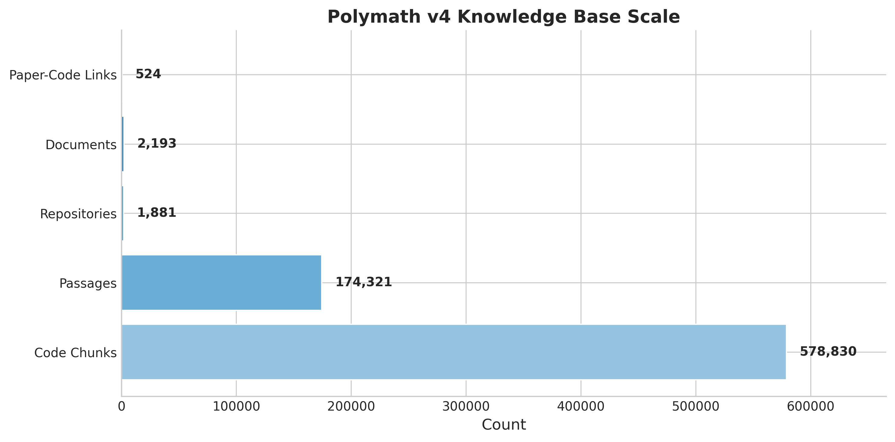
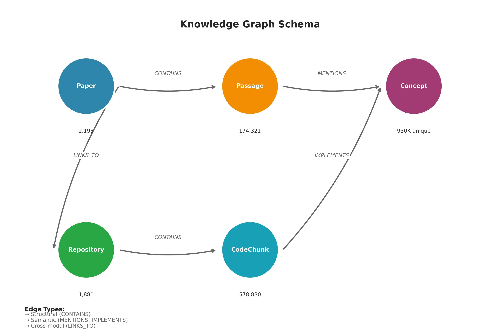

# Polymath v4

> **An evolving applied knowledge-skills hub for spatial multimodal data analysis—bridging theory, code, and actionable skills across domains.**


*Figure 1: The Polymath v4 architecture integrates unstructured scientific texts and structured codebases through a hybrid vector-graph engine. This enables novel applications including seamless navigation between theory and implementation ('Vibe Coding'), automated knowledge synthesis, and personalized concept mastery.*

---

## Status: Production Ready

**Last Audit:** 2026-01-19 | **Auditor:** Claude Opus 4.5 | **Result:** ✅ PASS

---

## Vision

Polymath is a personal polymathic system. Applications are still being discovered, but the core purpose is clear: **actionable, implementable knowledge that bridges theory and practice.**

This isn't just a paper database. It's:
- A **concept graph** connecting methods across fields (biology ↔ physics ↔ ML)
- A **code-paper bridge** linking implementations to theory
- A **skill repository** capturing successful workflows for reuse
- A **learning accelerator** for conceptual mastery

---

## Current State (2026-01-19)

| Component | Count | Status |
|-----------|-------|--------|
| **Documents** | 2,193 | ✅ |
| **Passages** | 174,321 | ✅ 100% embedded |
| **Concepts** | 7.36M | ✅ |
| **Repositories** | 1,881 | ✅ |
| **Code Chunks** | 578,830 | ✅ |
| **Neo4j Nodes** | 930K+ | ✅ |
| **Neo4j Edges** | 2.5M+ | ✅ |

### Knowledge Structure

<p align="center">
  
  
</p>

<p align="center">
  
  
</p>

---

## Quick Start

```bash
cd /home/user/polymath-v4

# Search papers
python scripts/q.py "spatial transcriptomics"

# Find code for papers (Code-Paper Bridge)
python scripts/q.py "gene expression prediction" --code

# Search repositories
python scripts/q.py "attention mechanisms" --repos

# Ingest a PDF
python scripts/ingest_pdf.py paper.pdf

# System health
python scripts/system_report.py --quick
```

---

## Architecture

```
polymath-v4/
├── lib/
│   ├── config.py              # Central config (thread-safe)
│   ├── db/postgres.py         # Connection pool (thread-safe)
│   ├── embeddings/bge_m3.py   # BGE-M3 embeddings (thread-safe)
│   ├── search/hybrid_search.py # Vector + BM25 + reranking
│   └── ingest/                # PDF parsing, chunking, asset detection
├── scripts/                   # CLI tools (28 scripts)
├── schema/                    # PostgreSQL migrations (001-010)
├── skills/                    # Operational skills
├── docs/                      # Documentation and audits
└── dashboard/                 # Streamlit UI
```

---

## Key Features

### Hybrid Search
Vector similarity + BM25 keyword matching + optional cross-encoder reranking.

```python
from lib.search.hybrid_search import search
results = search("gene expression prediction", n=10)
```

### Code-Paper Bridge
Find implementations for papers, or papers for code.

```bash
python scripts/q.py "transformer architecture" --code
```

### Concept Extraction
Automatic extraction of METHOD, PROBLEM, DOMAIN, ENTITY concepts via Gemini batch API.

```bash
python scripts/batch_concepts.py --submit --limit 100
python scripts/batch_concepts.py --process
```

### Neo4j Knowledge Graph
Papers → Passages → Concepts with MENTIONS edges for graph traversal.

```bash
python scripts/sync_neo4j.py --full
```

---

## Databases

| Store | Purpose | Connection |
|-------|---------|------------|
| **PostgreSQL** | Documents, passages, embeddings, concepts | `psql -U polymath -d polymath` |
| **Neo4j** | Concept graph | `bolt://localhost:7687` |

---

## Documentation

| Document | Purpose |
|----------|---------|
| `CLAUDE.md` | Claude Code guide with commands and config |
| `ARCHITECTURE.md` | System design and pipeline details |
| `docs/audits/` | Audit history and verification reports |
| `skills/` | Operational skills for common workflows |

---

## Roadmap

- [x] Core search pipeline (vector + BM25 + rerank)
- [x] Code-Paper Bridge
- [x] Neo4j graph synchronization
- [x] Concept extraction (batch API)
- [x] Stabilization audit (2026-01-19)
- [ ] SIMILAR_TO edges for concept clustering
- [ ] Flashcard generation for learning
- [ ] Gap analysis across polymathic connections

---

## License

MIT

---

## Acknowledgments

Built with [BGE-M3](https://huggingface.co/BAAI/bge-m3), [PostgreSQL](https://postgresql.org) + [pgvector](https://github.com/pgvector/pgvector), [Neo4j](https://neo4j.com), [PyMuPDF](https://pymupdf.readthedocs.io/).
