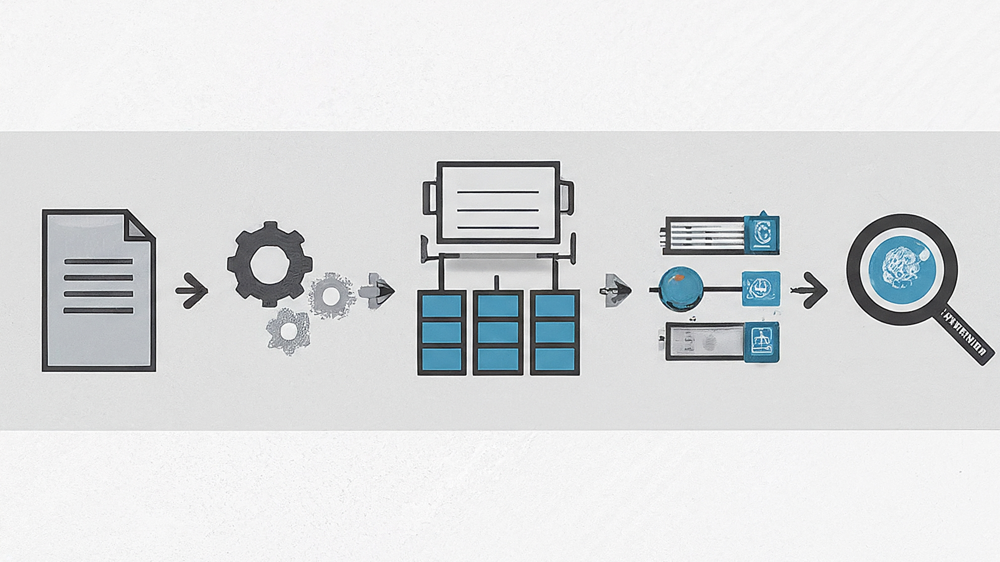

# Polymath v4: Polymathic Knowledge Base

> **A Postgres-first knowledge system for scientific papers, code repositories, and cross-domain insights.**

<p align="center">
  
</p>

<p align="center">
  <em>Document → Process → Store → Search: The Polymath pipeline transforms scientific papers into a searchable knowledge graph.</em>
</p>

---

```
┌─────────────────────────────────────────────────────────────────────────────┐
│                           POLYMATH v4 ARCHITECTURE                          │
├─────────────────────────────────────────────────────────────────────────────┤
│                                                                             │
│   ┌──────────────┐     ┌──────────────┐     ┌──────────────┐               │
│   │   SOURCES    │     │   INGEST     │     │    STORE     │               │
│   ├──────────────┤     ├──────────────┤     ├──────────────┤               │
│   │ • PDFs       │────▶│ • Parse      │────▶│ • PostgreSQL │               │
│   │ • Zotero CSV │     │ • Chunk      │     │   (pgvector) │               │
│   │ • GitHub     │     │ • Embed      │     │ • Neo4j      │               │
│   │ • arXiv      │     │ • Detect     │     │   (concepts) │               │
│   └──────────────┘     └──────────────┘     └──────────────┘               │
│                              │                     │                        │
│                              ▼                     ▼                        │
│                        ┌──────────────┐     ┌──────────────┐               │
│                        │   ENRICH     │     │   SEARCH     │               │
│                        ├──────────────┤     ├──────────────┤               │
│                        │ • CrossRef   │     │ • Semantic   │               │
│                        │ • OpenAlex   │     │ • BM25       │               │
│                        │ • S2         │     │ • Reranking  │               │
│                        └──────────────┘     └──────────────┘               │
│                                                    │                        │
│                                                    ▼                        │
│                                             ┌──────────────┐               │
│                                             │   OUTPUT     │               │
│                                             ├──────────────┤               │
│                                             │ • MCP Server │               │
│                                             │ • API        │               │
│                                             │ • CLI        │               │
│                                             └──────────────┘               │
│                                                                             │
└─────────────────────────────────────────────────────────────────────────────┘
```

## Overview

Polymath v4 is a **polymathic knowledge system** designed to:

1. **Ingest scientific papers** with rich metadata from Zotero, PDFs, and external APIs
2. **Extract assets** (GitHub repos, HuggingFace models, DOI citations) from paper text
3. **Enable semantic search** using BGE-M3 embeddings stored in PostgreSQL pgvector
4. **Build cross-domain connections** via concept extraction and Neo4j graph

### Key Statistics (Live Build)

| Metric | Count |
|--------|-------|
| Documents | 31,000+ |
| Embedded Passages | 53,000+ |
| GitHub Repos | 1,980+ |
| Concepts | 4.8M+ |

---

## Three-Stage Pipeline

```
┌─────────────────────────────────────────────────────────────────────────────┐
│                         INGESTION PIPELINE                                  │
├─────────────────────────────────────────────────────────────────────────────┤
│                                                                             │
│  STAGE 1: INGEST (Fast)                                                    │
│  ══════════════════════                                                    │
│                                                                             │
│  ┌─────────────┐    ┌─────────────┐    ┌─────────────┐    ┌─────────────┐ │
│  │   Zotero    │    │   Parse     │    │   Chunk     │    │   Embed     │ │
│  │   Metadata  │───▶│   PDF       │───▶│   Text      │───▶│   BGE-M3    │ │
│  │   Waterfall │    │   + OCR     │    │   Headers   │    │   1024-dim  │ │
│  └─────────────┘    └─────────────┘    └─────────────┘    └─────────────┘ │
│        │                  │                  │                  │          │
│        ▼                  ▼                  ▼                  ▼          │
│  ┌─────────────┐    ┌─────────────┐    ┌─────────────┐    ┌─────────────┐ │
│  │   Title     │    │   DOI       │    │   50-200    │    │   Detect    │ │
│  │   Authors   │    │   Extract   │    │   passages  │    │   Assets    │ │
│  │   Year      │    │   + Dedup   │    │   per doc   │    │   GitHub/HF │ │
│  └─────────────┘    └─────────────┘    └─────────────┘    └─────────────┘ │
│                                                                             │
├─────────────────────────────────────────────────────────────────────────────┤
│                                                                             │
│  STAGE 2: ENRICH (Background)                                              │
│  ════════════════════════════                                              │
│                                                                             │
│  ┌─────────────┐    ┌─────────────┐    ┌─────────────┐                    │
│  │  CrossRef   │    │  OpenAlex   │    │  Semantic   │                    │
│  │  Lookup     │───▶│  Citations  │───▶│  Scholar    │                    │
│  │  + Venue    │    │  + OA URLs  │    │  + Scores   │                    │
│  └─────────────┘    └─────────────┘    └─────────────┘                    │
│                                                                             │
├─────────────────────────────────────────────────────────────────────────────┤
│                                                                             │
│  STAGE 3: CONCEPTS (Batch)                                                 │
│  ═════════════════════════                                                 │
│                                                                             │
│  ┌─────────────┐    ┌─────────────┐    ┌─────────────┐                    │
│  │   Gemini    │    │   Extract   │    │   Sync to   │                    │
│  │   Batch     │───▶│   Concepts  │───▶│   Neo4j     │                    │
│  │   API       │    │   + Types   │    │   Graph     │                    │
│  └─────────────┘    └─────────────┘    └─────────────┘                    │
│                                                                             │
└─────────────────────────────────────────────────────────────────────────────┘
```

---

## Metadata Waterfall

Polymath uses a **waterfall approach** for metadata extraction, preferring richer sources:

```
┌─────────────────────────────────────────────────────────────────┐
│                    METADATA WATERFALL                           │
├─────────────────────────────────────────────────────────────────┤
│                                                                 │
│  1. ZOTERO CSV (Richest)                                       │
│     ├── Title, Authors, Year, Venue                            │
│     ├── DOI, Abstract                                          │
│     └── Zotero Key for linking                                 │
│              │                                                  │
│              ▼ (if no match)                                    │
│  2. DOI EXTRACTION                                             │
│     ├── Parse DOI from PDF text                                │
│     └── Use for CrossRef/OpenAlex lookup                       │
│              │                                                  │
│              ▼ (if no DOI)                                      │
│  3. PDF EXTRACTION                                             │
│     ├── Smart title extraction (skip headers, URLs)            │
│     ├── First meaningful line as title                         │
│     └── Filename as fallback                                   │
│                                                                 │
└─────────────────────────────────────────────────────────────────┘
```

---

## Deduplication Strategy

**Strict approach:** Prefer duplicates over losing unique papers.

```
┌─────────────────────────────────────────────────────────────────┐
│                    DEDUPLICATION CHECKS                         │
├─────────────────────────────────────────────────────────────────┤
│                                                                 │
│  CHECK 1: DOI Match                                            │
│  ─────────────────                                             │
│  • If DOI exists in database → SKIP (definite duplicate)       │
│                                                                 │
│  CHECK 2: PDF Hash Match                                       │
│  ───────────────────────                                       │
│  • If same file content → SKIP (same PDF)                      │
│                                                                 │
│  CHECK 3: Title + Year + Authors                               │
│  ──────────────────────────────                                │
│  • If all three match → SKIP (probable duplicate)              │
│  • Same title, different authors → INGEST (different paper)    │
│  • Same title, different year → INGEST (different paper)       │
│                                                                 │
└─────────────────────────────────────────────────────────────────┘
```

---

## Quick Start

### 1. Ingest a Single PDF

```bash
cd /home/user/polymath-v4
python scripts/ingest_pdf.py /path/to/paper.pdf
```

### 2. Batch Ingest with Zotero Metadata

```bash
# Prepare Zotero CSV (deduplicate, map paths)
python scripts/prepare_zotero_ingest.py '/path/to/My Library.csv'

# Ingest PDFs with rich metadata
python scripts/ingest_pdf.py /path/to/pdfs/ \
    --recursive \
    --zotero-csv /path/to/zotero_prepared.csv \
    --workers 2
```

### 3. Search the Knowledge Base

```python
from lib.search.hybrid_search import search

# Semantic search
results = search("spatial transcriptomics methods", n=10)
for r in results:
    print(f"[{r['score']:.3f}] {r['title']}")
```

### 4. Find Papers with Code

```python
from lib.db.postgres import get_connection

conn = get_connection()
cur = conn.cursor()
cur.execute("""
    SELECT d.title, d.year, r.repo_url
    FROM documents d
    JOIN paper_repos r ON d.doc_id = r.doc_id
    WHERE r.verified = true
    ORDER BY d.year DESC
    LIMIT 10
""")
for row in cur.fetchall():
    print(f"{row[0]} ({row[1]}): {row[2]}")
```

---

## Database Schema

```sql
┌─────────────────────────────────────────────────────────────────┐
│                      CORE TABLES                                │
├─────────────────────────────────────────────────────────────────┤
│                                                                 │
│  documents                                                      │
│  ──────────                                                     │
│  • doc_id (UUID, PK)                                           │
│  • title, authors[], year, venue                               │
│  • doi, pmid, arxiv_id (unique)                                │
│  • abstract, pdf_path, pdf_hash                                │
│  • zotero_key, source_method                                   │
│  • title_hash (for dedup)                                      │
│                                                                 │
│  passages                                                       │
│  ────────                                                       │
│  • passage_id (UUID, PK)                                       │
│  • doc_id (FK → documents)                                     │
│  • passage_text, section, page_num                             │
│  • embedding (vector[1024])                                    │
│  • quality_score                                               │
│                                                                 │
│  paper_repos                                                    │
│  ───────────                                                    │
│  • doc_id (FK → documents)                                     │
│  • repo_url, repo_owner, repo_name                             │
│  • detection_method, confidence                                │
│  • verified, verified_at                                       │
│                                                                 │
│  passage_concepts                                               │
│  ────────────────                                               │
│  • passage_id (FK → passages)                                  │
│  • concept_name, concept_type                                  │
│  • confidence, extractor_version                               │
│                                                                 │
└─────────────────────────────────────────────────────────────────┘
```

---

## Asset Detection

Polymath automatically detects assets mentioned in papers:

| Asset Type | Detection Pattern | Example |
|------------|-------------------|---------|
| **GitHub Repos** | `github.com/owner/repo` | `github.com/scverse/squidpy` |
| **HuggingFace Models** | `huggingface.co/model` | `facebook/dinov2-large` |
| **DOI Citations** | `10.xxxx/...` | `10.1038/s41586-025-09025-8` |
| **arXiv Papers** | `arxiv.org/abs/xxxx` | `2401.12345` |

---

## Performance

| Operation | Time | Notes |
|-----------|------|-------|
| Single PDF ingest | ~1.2s | With embeddings |
| Batch ingest (2 workers) | ~0.6s/PDF | Parallel processing |
| Semantic search | ~2s | First query (model loading) |
| Semantic search | ~0.5s | Subsequent queries |

---

## Project Structure

```
polymath-v4/
├── lib/
│   ├── config.py              # Central configuration
│   ├── embeddings/bge_m3.py   # BGE-M3 embeddings (thread-safe)
│   ├── search/hybrid_search.py # Vector + BM25 + reranking
│   ├── ingest/
│   │   ├── pdf_parser.py      # PyMuPDF text extraction
│   │   ├── chunking.py        # Text chunking
│   │   └── asset_detector.py  # GitHub/HF/citation detection
│   └── db/postgres.py         # Database connections
├── scripts/
│   ├── ingest_pdf.py          # PDF ingestion CLI
│   ├── prepare_zotero_ingest.py # Zotero CSV preparation
│   ├── batch_concepts.py      # Gemini batch concept extraction
│   └── system_report.py       # Health check
├── schema/                    # PostgreSQL migrations
├── skills/                    # Operational skills for Claude
└── docs/plans/                # Design documents
```

---

## Environment Variables

```bash
# Required
POSTGRES_DSN=dbname=polymath user=polymath host=/var/run/postgresql

# Optional - for enrichment
NEO4J_URI=bolt://localhost:7687
NEO4J_PASSWORD=your_password
GOOGLE_APPLICATION_CREDENTIALS=/path/to/service-account.json
```

---

## Skills (for Claude Code)

| Skill | Purpose |
|-------|---------|
| `polymath-pdf-ingestion` | Single/batch PDF ingestion |
| `polymath-fresh-ingest` | Full pipeline with Zotero |
| `polymath-search` | Semantic search operations |
| `polymath-batch-concepts` | Gemini concept extraction |
| `polymath-smoke-test` | End-to-end verification |

---

## License

MIT License - See [LICENSE](LICENSE) for details.

---

## Acknowledgments

Built with:
- [BGE-M3](https://huggingface.co/BAAI/bge-m3) - Multilingual embeddings
- [PostgreSQL](https://postgresql.org) + [pgvector](https://github.com/pgvector/pgvector) - Vector storage
- [PyMuPDF](https://pymupdf.readthedocs.io/) - PDF parsing
- [Neo4j](https://neo4j.com) - Graph database for concepts
